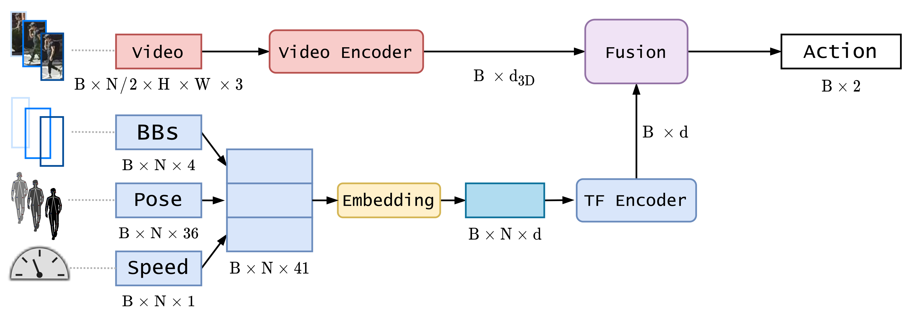

# CAPformer
[[Paper]](https://www.mdpi.com/1424-8220/21/17/5694)

**NOTE**: It is important to highlight that most of the code belongs to a previous version of [ykotseruba/PedestrianActionBenchmark](https://github.com/ykotseruba/PedestrianActionBenchmark). References to it have been included in the LICENSE file and in the [citation](#citation) section.
## Abstract

Anticipating pedestrian crossing behavior in urban scenarios is a challenging task for autonomous vehicles. Early this year, a benchmark comprising JAAD and PIE datasets have been released. In the benchmark, several state-of-the-art methods have been ranked. However, most of the ranked temporal models rely on recurrent architectures. In our case, we propose, as far as we are concerned, the first self-attention alternative, based on transformer architecture, which has had enormous success in natural language processing (NLP) and recently in computer vision. Our architecture is composed of various branches which fuse video and kinematic data. The video branch is based on two possible architectures: RubiksNet and TimeSformer. The kinematic branch is based on different configurations of transformer encoder. Several experiments have been performed mainly focusing on pre-processing input data, highlighting problems with two kinematic data sources: pose keypoints and ego-vehicle speed. Our proposed model results are comparable to PCPA, the best performing model in the benchmark reaching an F1 Score of nearly 0.78 against 0.77. Furthermore, by using only bounding box coordinates and image data, our model surpasses PCPA by a larger margin (F1=0.75 vs. F1=0.72). Our model has proven to be a valid alternative to recurrent architectures, providing advantages such as parallelization and whole sequence processing, learning relationships between samples not possible with recurrent architectures.

## System diagram

<p align="center">
  
</p>


# Installation instructions
1. Download and extract PIE and JAAD datasets.
	
	Follow the instructions provided in [https://github.com/aras62/PIE](https://github.com/aras62/PIE) and [https://github.com/ykotseruba/JAAD](https://github.com/ykotseruba/JAAD).

2. Download Python data interface.

	Copy `pie_data.py` and `jaad_data.py` from the corresponding repositories into `PedestrianActionBenchmark` directory.

3. Install docker (see instructions for [Ubuntu 16.04](https://chunml.github.io/ChunML.github.io/project/Installing-NVIDIA-Docker-On-Ubuntu-16.04/) and [Ubuntu 20.04](https://www.digitalocean.com/community/tutorials/how-to-install-and-use-docker-on-ubuntu-20-04)).

4. Change permissions for scripts in `docker` folder:
	```
	chmod +x docker/*.sh
	```

5. Build docker image

	```
	docker/build_docker.sh
	```

	Optionally, you may set custom image name and/or tag using this command (e.g. to use two GPUs in parallel):
	```
	docker/build_docker.sh -im <image_name> -t <tag>
	```

# Running instructions using Docker

## Run container in interactive mode:

Set paths for PIE and JAAD datasets in `docker/run_docker.sh` (see comments in the script).

Then run:

```
docker/run_docker.sh
```

### Train and test models

Use `train_test.py` script with `config_file`:
```
python train_test.py -c <config_file>
```

For example, to train PCPA model run:  

```
python train_test.py -c config_files/PCPA.yaml
```

The script will automatially save the trained model weights, configuration file and evaluation results in `models/<dataset>/<model_name>/<current_date>/` folder.

See comments in the `configs_default.yaml` and `action_predict.py` for parameter descriptions.

Model-specific YAML files contain experiment options `exp_opts` that overwrite options in `configs_default.yaml`.

### Test saved model

To re-run test on the saved model use:

```
python test_model.py <saved_files_path>
```

For example:
```
python test_model.py models/jaad/PCPA/01Oct2020-07h21m33s/
```

## Authors

* **[Iuliia Kotseruba](http://www.cse.yorku.ca/~yulia_k/)**
* **[Amir Rasouli](http://www.cse.yorku.ca/~aras/index.html)**

Please email yulia_k@eecs.yorku.ca or arasouli.ai@gmail.com if you have any issues with running the code or using the data.

<a name="license"></a>
## License
This project is licensed under the MIT License - see the [LICENSE](LICENSE) file for details


<a name="citation"></a>
## Citation

If you use the results, analysis or code for the models presented in the paper, please cite:

```
@Article{s21175694,
AUTHOR = {Lorenzo, Javier and Alonso, Ignacio Parra and Izquierdo, Rubén and Ballardini, Augusto Luis and Saz, Álvaro Hernández and Llorca, David Fernández and Sotelo, Miguel Ángel},
TITLE = {CAPformer: Pedestrian Crossing Action Prediction Using Transformer},
JOURNAL = {Sensors},
VOLUME = {21},
YEAR = {2021},
NUMBER = {17},
ARTICLE-NUMBER = {5694},
URL = {https://www.mdpi.com/1424-8220/21/17/5694},
PubMedID = {34502584},
ISSN = {1424-8220},
DOI = {10.3390/s21175694}
}

@inproceedings{kotseruba2021benchmark,
	title={{Benchmark for Evaluating Pedestrian Action Prediction}},
	author={Kotseruba, Iuliia and Rasouli, Amir and Tsotsos, John K},
	booktitle={Proceedings of the IEEE Winter Conference on Applications of Computer Vision (WACV)},
	pages={1258--1268},
	year={2021}
}
```

If you use model implementations provided in the benchmark, please cite the corresponding papers

- ATGC [1] 
- C3D [2]
- ConvLSTM [3]
- HierarchicalRNN [4]
- I3D [5]
- MultiRNN [6]
- PCPA [7]
- SFRNN [8] 
- SingleRNN [9]
- StackedRNN [10]
- Two_Stream [11]

[1] Amir Rasouli, Iuliia Kotseruba, and John K Tsotsos. Are they going to cross?  A benchmark dataset and baseline for pedestrian crosswalk behavior.  ICCVW, 2017.

[2] Du Tran, Lubomir Bourdev, Rob Fergus, Lorenzo Torresani,and Manohar Paluri. Learning spatiotemporal features with 3D convolutional networks. ICCV, 2015.

[3] Xingjian Shi, Zhourong Chen, Hao Wang, Dit-Yan Yeung,Wai-Kin Wong, and Wang-chun Woo. Convolutional LSTM network:  A machine learning approach for precipitation nowcasting. NeurIPS, 2015.

[4] Yong Du, Wei Wang, and Liang Wang. Hierarchical recurrent neural network for skeleton based action recognition. CVPR, 2015

[5] Joao Carreira and Andrew Zisserman.  Quo vadis, action recognition?  A new model and the kinetics dataset.  CVPR, 2017.

[6] Apratim Bhattacharyya, Mario Fritz, and Bernt Schiele. Long-term on-board prediction of people in traffic scenes under uncertainty. CVPR, 2018.

[7] Iuliia Kotseruba, Amir Rasouli, and John K Tsotsos, Benchmark for evaluating pedestrian action prediction. WACV, 2021.

[8] Amir Rasouli, Iuliia Kotseruba, and John K Tsotsos. Pedestrian Action Anticipation using Contextual Feature Fusion in Stacked RNNs. BMVC, 2019

[9] Iuliia Kotseruba, Amir Rasouli, and John K Tsotsos.  Do They Want to Cross? Understanding Pedestrian Intention for Behavior Prediction. In IEEE Intelligent Vehicles Symposium (IV), 2020.

[10] Joe Yue-Hei Ng, Matthew Hausknecht, Sudheendra Vi-jayanarasimhan, Oriol Vinyals, Rajat Monga, and GeorgeToderici. Beyond short snippets: Deep networks for video classification. CVPR, 2015.

[11] Karen Simonyan and Andrew Zisserman. Two-stream convolutional networks for action recognition in videos. NeurIPS, 2014.
